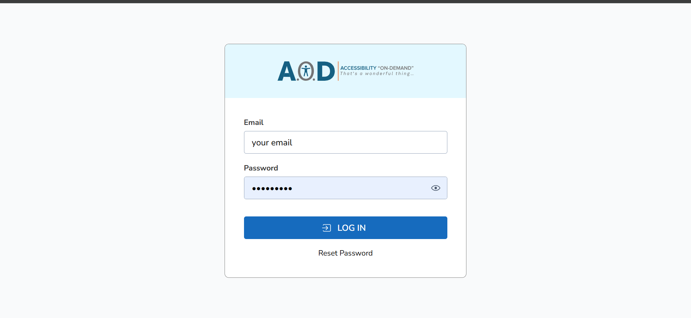
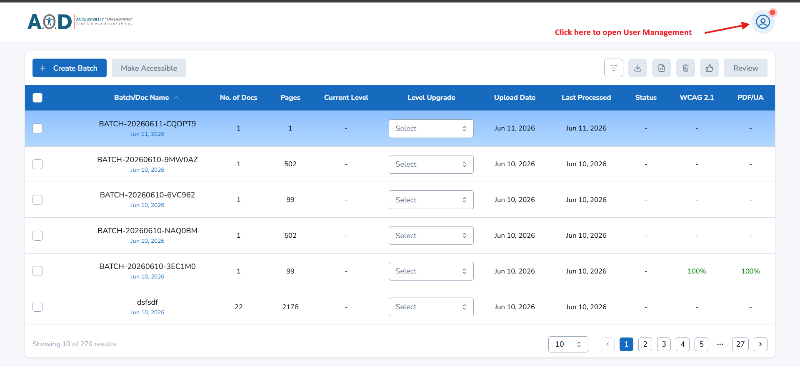
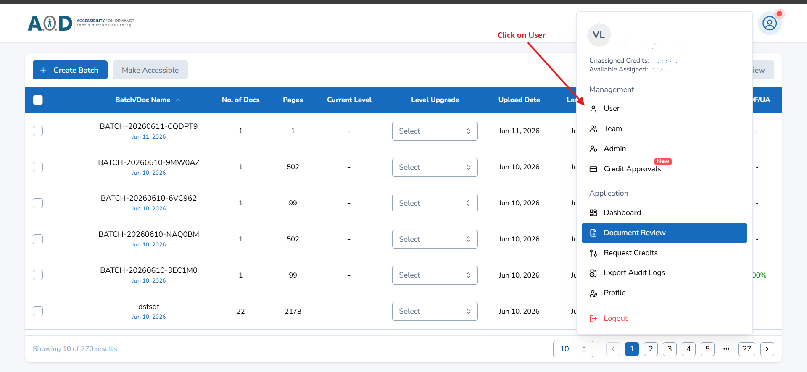
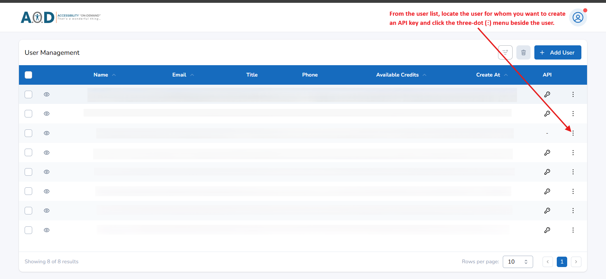
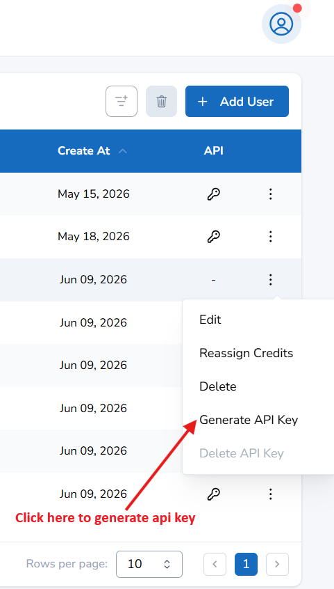
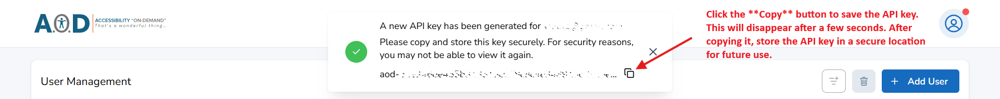

<a id="top"></a>

# AOD-API — Accessibility On Demand API

> The Accessibility On Demand API lets you make PDFs accessible: upload a PDF, get back a tagged (accessibility-enhanced) version, and generate an axes4 accessibility score for the tagged PDF.

This guide is written so that **anyone** can call these APIs. Just follow the steps in order. The API works the same way no matter which programming language you use.

---

## Table of Contents

1. [What is this API?](#1-what-is-this-api)
2. [Before you start (what you need)](#2-before-you-start-what-you-need)
3. [How to get your API Key](#3-how-to-get-your-api-key)
4. [Where to put your API Key](#4-where-to-put-your-api-key)
5. [List of all APIs (what each one does)](#5-list-of-all-apis-what-each-one-does)
6. [Rate limits](#6-rate-limits)
7. [How to call the APIs (pick your language)](#7-how-to-call-the-apis-pick-your-language)
8. [A full end-to-end walkthrough](#8-a-full-end-to-end-walkthrough)
9. [Full examples for every endpoint (curl + responses)](#9-full-examples-for-every-endpoint-curl--responses)
   - [Endpoint 1 — Upload files directly (form-data)](#endpoint-1--upload-files-directly-form-data)
   - [Endpoint 2 — Upload files from signed URLs](#endpoint-2--upload-files-from-signed-urls)
   - [Endpoint 3 — Check upload status](#endpoint-3--check-upload-status)
   - [Endpoint 4 — Start a processing job](#endpoint-4--start-a-processing-job)
   - [Endpoint 5 — Check job & get tagged PDF](#endpoint-5--check-job--get-tagged-pdf)
   - [Endpoint 6 — Request a score report](#endpoint-6--request-a-score-report)
   - [Endpoint 7 — Get the score report](#endpoint-7--get-the-score-report)
   - [Common errors (all endpoints)](#common-errors-all-endpoints)
10. [Understanding errors](#10-understanding-errors)
11. [FAQ](#11-faq)

---

## 1. What is this API?

The Accessibility On Demand API helps you turn ordinary PDF files into accessible ones that people using screen readers and other assistive tools can read properly. You upload a PDF, the API adds the accessibility tags for you, and you can download the tagged version back. You can also ask the API for an **axes4 accessibility score**, which tells you how accessible the tagged PDF is.

- **Base URL:** `https://api.accessibilityondemand.space/api/v1`
  *(This is the web address all the APIs live under. Every call starts with this, followed by the specific endpoint — for example `https://api.accessibilityondemand.space/api/v1/files/upload/`.)*
- **Authentication:** Bearer token (an API key you send with every request).
- **Data format:** JSON (a simple text format for sending and receiving data).

> 📄 **PDFs only.** This API only accepts **PDF files** — for both upload methods (direct upload and signed URL). Any non-PDF file is rejected.

[⬆ Back to top](#top)

---

## 2. Before you start (what you need)

To call this API, you need two things:

1. **A way to run code** in the language of your choice — Python, Node.js, Java, or .NET. Pick whichever you're comfortable with.
2. **A code editor or terminal** to edit and run the files — for example, VS Code or your system's built-in terminal.

> 💡 **New to this?** Installing a language and a code editor is a one-time setup that takes about 10–15 minutes. There are plenty of free, up-to-date guides for it — a quick search like "how to install Python" (or Node.js / Java / .NET) or asking an AI assistant will get you set up. Pick whichever resource (article, video, or official docs) suits you best.

This guide focuses on **how to call the API**. Once your chosen language is installed, you're ready to go.

[⬆ Back to top](#top)

---

## 3. How to get your API Key

An **API Key** is like a password that proves you are allowed to use the API. You send it with every request so the API knows the calls are coming from you.

> ℹ️ **Note:** API keys are always generated for a **User**-role account. As a Customer (Admin / Super Admin), you create keys for the users under you and share the key with that user to use; if you want to use the API yourself, create your own User account and generate a key for it. If you are a User, your Customer generates your key and shares it with you.

Follow these steps to generate a key:

1. Go to **<https://app.accessibilityondemand.ai/login>** and log in with your **Admin** or **Super Admin** account.

   

2. On the dashboard, click the **profile icon** in the top-right corner to open the menu.

   

3. In the menu, under **Management**, click **User** to open User Management.

   

4. Choose who the key is for:
   - **New user:** Click **Add User** to create a **User**-role account first, and allot them sufficient credits to use the API.
   - **Existing user:** Make sure they already have enough credits.

5. Find that user in the list and click the **three-dot (⋮) menu** at the end of their row.

   

6. In the menu that opens, click **Generate API Key**.

   

7. A confirmation appears with the new key. Click the **Copy** button and store the key somewhere safe.

   

   The key looks something like this:

   ```
   aod-xxxxxxxxxxxxxxxxxxxx
   ```

> ⚠️ **You may only see the key once.** For security, the key is shown a single time and the message disappears after a few seconds. Copy it immediately and store it securely — if you lose it, you'll need to generate a new one.

> ⚠️ **Keep your API key private.** Share it only with the specific user it was created for. Never publish it or post it publicly (on GitHub, social media, screenshots, etc.) — anyone who has the key can use the API as that user and spend their credits.

[⬆ Back to top](#top)

---

## 4. Where to put your API Key

The API key is sent with every request inside something called a **header**, in this exact format:

```
Authorization: Bearer YOUR_API_KEY_HERE
```

Example:

```
Authorization: Bearer aod-xxxxxxxxxxx
```

Breaking that down:
- `Authorization` is the name of the header.
- `Bearer` must be written exactly as shown, followed by **one space**.
- `aod-xxxxxxxxxxx` is your actual API key (the one you copied in Section 3).

You don't need to set this up by hand — the ready-made files in each language folder do it for you. You only have to paste your key in **one place**: the [config.json](config.json) file in the repository root (the folder that contains `java/`, `dotnet/`, `node/`, `python-sync/`, and `python-async/`). Every language reads the same `config.json`, so you fill it in **once** and the rest is handled automatically.

```json
{
  "api_key": "aod-xxxxxxxxxxx",
  "description": "description about batch - optional",
  "sign_urls": ["https://your-signed-url-1", "https://your-signed-url-2"],
  "process": { "file_id": "", "level": 1 },
  "report":  { "file_id": "" }
}
```

You never edit the language files themselves. See [Section 7](#7-how-to-call-the-apis-pick-your-language) for what each `config.json` field is for and when to fill it in, and your language folder's own README for the exact path and commands.

[⬆ Back to top](#top)

---

## 5. List of all APIs (what each one does)

| # | Method | Endpoint (add after Base URL) | What it does |
|---|--------|-------------------------------|--------------|
| 1 | POST   | `/files/upload/`               | Uploads one or more PDFs **directly** as `multipart/form-data` (`files` + optional `description`). Returns a **file_id** for each accepted file. |
| 2 | POST   | `/files/upload-from-url/`      | Starts a file upload **from signed URLs**. You send **sign_urls** in the payload, and it returns the **file_ids** of the uploaded URLs. |
| 3 | GET    | `/files/status/{file_id}`      | Returns the upload **status** (`Uploading` / `Uploaded`) for the given file_id. |
| 4 | POST   | `/jobs/`                       | Sends an uploaded PDF for processing. Takes a successfully uploaded **file_id** and a **level** (1 or 2). Returns a **job_id**. |
| 5 | GET    | `/jobs/{job_id}`               | Returns the processing **status** and a **link to the tagged PDF**. |
| 6 | POST   | `/report/`                     | Requests an axes4 score report. Takes a **file_id** and returns a **job_id** for the report. |
| 7 | GET    | `/report/{job_id}`             | Returns the report **status** and a **link to the generated score report PDF** for the file. |

> 📄 **PDFs only** — both upload endpoints (1 and 2) accept **PDF files only**. Non-PDF files are rejected.

> 🔗 **Don't have a signed URL yet?** See [How to get a signed URL](docs/getting-signed-urls.md) — step-by-step for Amazon S3 and Google Drive.

[⬆ Back to top](#top)

---

## 6. Rate limits

To keep the service fast and fair for everyone, every endpoint limits how often you can call it. If you go over a limit, the API replies with **`429 Too Many Requests`** and a `retry-after-sec` value telling you how many seconds to wait before trying again.

**Base limit (all endpoints):** 1 request per second, per user.

Two endpoints add an **extra cooldown** on top of that base limit. The full breakdown:

| # | Endpoint | Rate limit |
|---|----------|------------|
| 1 | `POST /files/upload/`          | Base limit **+** an extra cooldown equal to the **number of files** sent (e.g. 5 files → ~5 sec), per user. |
| 2 | `POST /files/upload-from-url/` | Base limit **+** an extra cooldown equal to the **number of signed URLs** sent (e.g. 5 URLs → ~5 sec), per user. |
| 3 | `GET /files/status/{file_id}`  | Base limit only (1 request/sec), per user. |
| 4 | `POST /jobs/`                  | Base limit **+** an extra cooldown of **pages ÷ 10** (e.g. a 100-page file → 100 ÷ 10 → wait about ~10 sec), per user. |
| 5 | `GET /jobs/{job_id}`           | Base limit only (1 request/sec), per user. |
| 6 | `POST /report/`                | Base limit only (1 request/sec), per user. |
| 7 | `GET /report/{job_id}`         | Base limit only (1 request/sec), per user. |

> 🔁 **Polling tip.** The "check" endpoints (3, 5, 7) allow 1 request/sec, but you don't need to poll that fast. Polling **every few seconds** is plenty and keeps you well clear of `429`. Remember that every poll counts against the rate limit, so don't hammer it in a tight loop.

When you hit a limit, you'll get a response like this:

```json
{
  "success": false,
  "error": {
    "code": "RATE_LIMIT_EXCEEDED",
    "message": "Too many requests",
    "details": [
      { "retry-after-sec": 39 }
    ]
  },
  "request_id": "f1045cbb-5c6c-4944-8684-65e8c1e23fc8",
  "timestamp": "2026-05-29T13:21:45.489020+00:00"
}
```

Just wait the number of seconds shown in `retry-after-sec`, then try again.

[⬆ Back to top](#top)

---

## 7. How to call the APIs (pick your language)

The flow is the same in every language. To make it easy, each language has its **own folder** in this repository with **7 ready-to-run files** — one per step. You don't edit those files at all: you fill in a single [config.json](config.json), and every language reads from it.

```
your-project/
├── config.json          ← the ONE file you edit (shared by every language)
├── uploads/             ← drop your PDFs here for a direct upload (Endpoint 1)
├── java/                Java step files          (+ its own data.json / errors.json)
├── dotnet/              .NET step files          (+ its own data.json / errors.json)
├── node/                Node.js step files       (+ its own data.json / errors.json)
├── python-sync/         Python (requests)        (+ its own data.json / errors.json)
├── python-async/        Python (httpx + asyncio) (+ its own data.json / errors.json)
└── docs/
    └── getting-signed-urls.md
```

| Language | Folder | Status |
|----------|--------|--------|
| Python (sync)  | [`/python-sync`](python-sync)   | ✅ Available |
| Python (async) | [`/python-async`](python-async) | ✅ Available |
| Node.js  | [`/node`](node)     | ✅ Available |
| Java     | [`/java`](java)     | ✅ Available |
| .NET     | [`/dotnet`](dotnet) | ✅ Available |

> **Sync vs async (Python):** Use **sync** if you're new or doing things one step at a time — it's the simplest. Use **async** if you want to check many files/jobs at the same time for speed. Both do exactly the same API calls.

### The flow (same for every language)

1. **Upload** your file(s) → get a `file_id` for each (status starts as `Uploading`). *(Two ways: drop PDFs into the **`uploads/`** folder for a direct upload, or use a signed URL — see [How to get a signed URL](docs/getting-signed-urls.md). Either way, the file must be a **PDF**.)*

   > 🧹 **Clean up after Step 1 runs.** Once you've run Step 1 and have your `file_id`s, the upload is done — there's no need to send those files again. **Remove the PDFs from the `uploads/` folder** (and **clear the `sign_urls` list in `config.json`**) so the next run doesn't re-upload the same files by mistake. You don't keep re-hitting the upload endpoint; Steps 2–6 use the `file_id`, not the original file or URL.
2. **Check upload** → repeat until the status is `Uploaded`.
3. **Create a job** with a `file_id` and a level (1 or 2) → get a `job_id`.
4. **Check the job** → when `Completed`, get the tagged-PDF download link.
5. **Request a report** with a `file_id` → get a report `job_id`.
6. **Check the report** → when `Completed`, get the score-report PDF download link.

### Which upload should I use? (Endpoint 1 vs Endpoint 2)

You upload files in **one of two ways — pick whichever fits you.** They're alternatives; you don't need both. **Either way, only PDF files are accepted.**

| Your situation | Use | How |
|----------------|-----|-----|
| **I just have PDFs on my computer** and no cloud account | **Direct upload** (Endpoint 1) | Clone this repo, drop your PDFs into the **`uploads/`** folder, and run Step 1. It picks up every PDF automatically — nothing else to set up. |
| **My files already live in S3 or Google Drive**, or I already have signed URLs | **Upload from signed URL** (Endpoint 2) | Put your signed URL(s) in `config.json` under `sign_urls`, then run Step 1. Each URL must point to a PDF. New to signed URLs? See [How to get a signed URL](docs/getting-signed-urls.md). |

After this first step, **everything else is identical** — both paths give you a `file_id`, and Steps 2–6 work exactly the same no matter which upload you used.

### How the ready-made files work

- **You edit one file:** [config.json](config.json) — it holds your `api_key`, `sign_urls`, the `process` file/level, and the `report` file. You fill it in **as you go** (URLs before Step 1, `process.file_id` before Step 3, `report.file_id` before Step 5). You never edit the language files themselves.
- Running a step **prints the result on screen** AND **saves the important values** (file_ids, job_ids, and their status) into a **`data.json`** file **inside that language folder**. Each language keeps its own `data.json`, so running, say, Node and Python side by side won't collide.
- Anything that **isn't** a clean success — a 207 partial upload, a non-200 response, or a failed job/report — is kept out of `data.json` and written to a separate **`errors.json`** in the same folder (grouped into `url_errors` / `file_errors` / `job_errors` / `other`, append-only, each with a UTC timestamp).
- The "check" files (steps 2, 4, 6) automatically **loop through everything saved**, skip anything already finished, and update the rest. They are safe to run again and again until everything is done.

Each language folder therefore has three JSON files in play:

| File | Where | You… | Holds |
|------|-------|------|-------|
| `config.json` | repo **root** (shared) | **edit** this | your api_key, sign_urls, process/report file ids + level |
| `data.json`   | inside the language folder | **view** (auto-written) | clean tracked items (file_uploads, job_process, report_process) |
| `errors.json` | inside the language folder | **view** when something fails | grouped error history |

Here is roughly what `data.json` looks like after a few steps:

```json
{
  "file_uploads": [
    { "file_id": "aaa950240561cd149157e054", "status": "Uploaded" }
  ],
  "job_process": [
    {
      "file_id": "aaa950240561cd149157e054",
      "job_id": "job_123",
      "status": "Completed",
      "details": { "download_url": "...", "expires_in_seconds": 300 }
    }
  ],
  "report_process": [
    { "file_id": "aaa950240561cd149157e054", "job_id": "rep_123", "status": "Processing" }
  ]
}
```

> 📂 **Open your language's folder and follow its own README** for the exact path to `config.json`, the path to that folder's `data.json` / `errors.json`, and the commands to run each step (each README tells you to `cd` into the folder first). The API behaves identically regardless of language — see [Section 9](#9-full-examples-for-every-endpoint-curl--responses) for the raw requests and responses.

> ⏳ **Download links expire** (see `expires_in_seconds`, e.g. 300 = 5 minutes, 0 = link expired). Download the file promptly and store it.

[⬆ Back to top](#top)

---

## 8. A full end-to-end walkthrough

This threads a single file all the way through, so you can see how one step feeds the next. Replace `aod-xxxxxxxxxxx` with your key. (Section 9 has the full request/response detail for each call.)

**Step 1 — Upload a PDF (direct).** Returns a `file_id`.

```bash
curl -X POST "https://api.accessibilityondemand.space/api/v1/files/upload/" \
  -H "Authorization: Bearer aod-xxxxxxxxxxx" \
  -F "files=@/path/to/sample.pdf"
# → file_id: aaa950240561cd149157e054  (status: Uploading)
```

**Step 2 — Poll upload status** every few seconds until it reads `Uploaded`.

```bash
curl -X GET "https://api.accessibilityondemand.space/api/v1/files/status/aaa950240561cd149157e054" \
  -H "Authorization: Bearer aod-xxxxxxxxxxx"
# → uploading_status: Uploaded
```

**Step 3 — Start a processing job** with that `file_id`. Returns a `job_id`.

```bash
curl -X POST "https://api.accessibilityondemand.space/api/v1/jobs/" \
  -H "Authorization: Bearer aod-xxxxxxxxxxx" \
  -H "Content-Type: application/json" \
  -d '{ "file_id": "aaa950240561cd149157e054", "level": 1 }'
# → job_id: job_123
```

**Step 4 — Poll the job** until `Completed`, then download the tagged PDF from `download_url` (before it expires).

```bash
curl -X GET "https://api.accessibilityondemand.space/api/v1/jobs/job_123" \
  -H "Authorization: Bearer aod-xxxxxxxxxxx"
# → status: Completed, details.download_url: ...
```

**Step 5 — Request a score report** for the same `file_id`. Returns a report `job_id`.

```bash
curl -X POST "https://api.accessibilityondemand.space/api/v1/report/" \
  -H "Authorization: Bearer aod-xxxxxxxxxxx" \
  -H "Content-Type: application/json" \
  -d '{ "file_id": "aaa950240561cd149157e054" }'
# → job_id: rep_123
```

**Step 6 — Poll the report** until `Completed`, then download the score-report PDF.

```bash
curl -X GET "https://api.accessibilityondemand.space/api/v1/report/rep_123" \
  -H "Authorization: Bearer aod-xxxxxxxxxxx"
# → status: Completed, details.download_url: ...
```

That's the whole lifecycle: **upload → wait → tag → download → score → download.**

[⬆ Back to top](#top)

---

## 9. Full examples for every endpoint (curl + responses)

This section shows the **raw request and response** for each API, using `curl` (a command-line tool available on Mac, Linux, and Windows). Use it to understand exactly what each endpoint expects and returns — useful for debugging or for calling the API in any language.

In every example, replace `aod-xxxxxxxxxxx` with your API key.

> ℹ️ **About error messages:** where a `message` shows options separated by `/`, it means the API returns **one** of those messages depending on the situation — not all of them at once. Common errors that can occur on **any** endpoint (401, 402, 422, 429, 500, 503, etc.) are listed once at the [end of this section](#common-errors-all-endpoints), so they aren't repeated for every endpoint.

Jump to an endpoint:

- [Endpoint 1 — Upload files directly (form-data)](#endpoint-1--upload-files-directly-form-data)
- [Endpoint 2 — Upload files from signed URLs](#endpoint-2--upload-files-from-signed-urls)
- [Endpoint 3 — Check upload status](#endpoint-3--check-upload-status)
- [Endpoint 4 — Start a processing job](#endpoint-4--start-a-processing-job)
- [Endpoint 5 — Check job & get tagged PDF](#endpoint-5--check-job--get-tagged-pdf)
- [Endpoint 6 — Request a score report](#endpoint-6--request-a-score-report)
- [Endpoint 7 — Get the score report](#endpoint-7--get-the-score-report)
- [Common errors (all endpoints)](#common-errors-all-endpoints)

---

### Endpoint 1 — Upload files directly (form-data)

`POST /files/upload/`

Uploads one or more PDFs **directly from your computer** as `multipart/form-data`. Returns a `file_id` for each accepted file. This is the alternative to signed URLs (Endpoint 2) when you'd rather send the file itself.

> 📄 **PDF only.** Only `.pdf` files are accepted. Any non-PDF file is rejected.

> 📁 **Easiest way (with the ready-made code):** drop your PDFs into the repo's [uploads](uploads) folder and run Step 1 — it automatically picks up every PDF in that folder, so you don't type any file paths. Just copy/move your files into `uploads/` first. (See your language folder's README.)

> 🧹 **Remove files after upload.** Once Step 1 has run and you have your `file_id`s, **delete (or move) those PDFs out of the `uploads/` folder**. The upload is finished — keeping them there means the next run will upload the same files again by mistake. Steps 2–6 only need the `file_id`, not the original file.

**Form fields**

| Field | Required | Meaning |
|-------|----------|---------|
| `files` | yes | One or more **PDF** files (`.pdf` only — non-PDF files are rejected). Repeat the field to send several (`-F "files=@a.pdf" -F "files=@b.pdf"`). |
| `description` | no | Optional text describing the batch |

> ⏱️ **Rate limited** — see [Section 6](#6-rate-limits). Cooldown grows with the number of files you send.

**Request**

```bash
curl -X POST "https://api.accessibilityondemand.space/api/v1/files/upload/" \
  -H "Authorization: Bearer aod-xxxxxxxxxxx" \
  -F "files=@/path/to/sample.pdf" \
  -F "files=@/path/to/another.pdf" \
  -F "description=description about batch - optional"
```

> ℹ️ Don't set `Content-Type` yourself — `curl -F` (and your HTTP library) sets `multipart/form-data` with the correct boundary automatically.

**Success — `200 OK`** (all files accepted)

```json
{
  "success": true,
  "data": {
    "code": "SUCCESS",
    "message": "All batch uploading started.",
    "details": [
      {
        "successful_uploads": [
          {
            "success": true,
            "file_id": "aaa950240561cd149157e054",
            "filename": "sample.PDF.pdf",
            "status": "Uploading"
          }
        ]
      }
    ]
  },
  "message": "Files accepted for uploading, file upload started",
  "request_id": "9f5b2df0-2755-4346-a696-3c8393e4a2fe",
  "timestamp": "2026-06-05T12:01:31.739179+00:00"
}
```

**Partial success — `207 Multi-Status`** (some files succeeded, some failed)

```json
{
  "success": false,
  "error": {
    "code": "PARTIAL_SUCCESS",
    "message": "Some file successfully started uploading , some files had errors",
    "details": [
      {
        "successful_uploads": [
          {
            "success": true,
            "file_id": "aaa950240561cd149157e054",
            "filename": "sample.PDF.pdf",
            "status": "Uploading"
          },
          {
            "success": true,
            "file_id": "aaa950240561cd149157e055",
            "filename": "Lorem Ipsum-1-1.pdf",
            "status": "Uploading"
          }
        ],
        "failed_uploads": [
          {
            "filename": "eicar_embedded.pdf",
            "status": 400,
            "detail": "PDF rejected: malware detected: Eicar-Test-Signature"
          }
        ]
      }
    ]
  },
  "request_id": "9f5b2df0-2755-4346-a696-3c8393e4a2fe",
  "timestamp": "2026-06-05T12:01:31.739179+00:00"
}
```

**Field explanations**

| Field | Meaning |
|-------|---------|
| `successful_uploads[].file_id` | The ID you use in later steps. **Save this.** |
| `successful_uploads[].filename` | The name of the file that was accepted |
| `successful_uploads[].status` | Always `Uploading` at this point |
| `failed_uploads[].filename` | The file that could not be accepted |
| `failed_uploads[].detail` | Why it failed (e.g. not a PDF, malware detected, unsupported content) |
| `request_id` | Unique ID for this request — quote it if contacting support |

(This endpoint shares the same success/207 shape as Endpoint 2 — the only difference is each entry carries a **`filename`** instead of a **`url`**.)

[⬆ Back to top](#top)

---

### Endpoint 2 — Upload files from signed URLs

`POST /files/upload-from-url/`

Starts uploading one or more files from signed URLs. Returns a `file_id` for each accepted file.

> 📄 **PDF only.** Each signed URL must point to a **PDF file** (`.pdf`). URLs that resolve to a non-PDF file are rejected.

> 🧹 **Clear `sign_urls` after upload.** Once you've hit this endpoint and have your `file_id`s, the URLs have done their job — **remove them from the `sign_urls` list in `config.json`**. Leaving them there means the next run will re-upload the same files by mistake. Steps 2–6 only need the `file_id`.

> 🔗 New to signed URLs? See [How to get a signed URL](docs/getting-signed-urls.md) for S3 and Google Drive.

> ⏱️ **Rate limited** — see [Section 6](#6-rate-limits). Cooldown grows with the number of URLs you send.

**Request**

```bash
curl -X POST "https://api.accessibilityondemand.space/api/v1/files/upload-from-url/" \
  -H "Authorization: Bearer aod-xxxxxxxxxxx" \
  -H "Content-Type: application/json" \
  -d '{
    "sign_urls": [
      "https://your-signed-url-1",
      "https://your-signed-url-2"
    ],
    "description": "description about batch - optional"
  }'
```

**Success — `200 OK`** (all files accepted)

```json
{
  "success": true,
  "data": {
    "code": "SUCCESS",
    "message": "All batch uploading started.",
    "details": [
      {
        "successful_uploads": [
          {
            "success": true,
            "file_id": "aaa950240561cd149157e054",
            "url": "my url",
            "status": "Uploading"
          }
        ]
      }
    ]
  },
  "message": "Files accepted for uploading, file upload started",
  "request_id": "beb7d0c9-52ae-48af-a1b9-3d4a1b1cbca7",
  "timestamp": "2026-05-29T08:14:02.465082+00:00"
}
```

**Partial success — `207 Multi-Status`** (some files succeeded, some failed)

```json
{
  "success": false,
  "error": {
    "code": "PARTIAL_SUCCESS",
    "message": "Some file successfully started uploading , some files had errors",
    "details": [
      {
        "successful_uploads": [
          {
            "success": true,
            "file_id": "aaa950240561cd149157e054",
            "url": "url1",
            "status": "Uploading"
          }
        ],
        "failed_uploads": [
          {
            "url": "url2",
            "status": 400,
            "detail": "Unable to download from the provided URL. Supported sources: s3, gdrive. Please provide a URL from one of these sources."
          },
          {
            "url": "url3",
            "status": 400,
            "detail": "Access denied or URL expired"
          },
          {
            "url": "url4",
            "status": 400,
            "detail": "Malicious file detected"
          }
        ]
      }
    ]
  },
  "request_id": "a00e457c-ba20-4d05-afb8-82b34cc6dbf1",
  "timestamp": "2026-05-29T08:16:45.095922+00:00"
}
```

**Failed — `400 Bad Request`** (all files failed)

```json
{
  "success": false,
  "error": {
    "code": "BAD_REQUEST",
    "message": "All batch uploads failed.",
    "details": [
      {
        "field": "url1",
        "message": "some error"
      },
      {
        "field": "url2",
        "message": "Unsupported content type: text/plain"
      }
    ]
  },
  "request_id": "a00e457c-ba20-4d05-afb8-82b34cc6dbf1",
  "timestamp": "2026-05-29T08:16:45.095922+00:00"
}
```

**Field explanations**

| Field | Meaning |
|-------|---------|
| `success` | `true` if every file was accepted; `false` if any failed |
| `data.details` / `error.details` | List of upload result blocks (success uses `data.details`, partial uses `error.details`) |
| `successful_uploads[].file_id` | The ID you use in later steps. **Save this.** |
| `successful_uploads[].status` | Always `Uploading` at this point |
| `failed_uploads[].url` | The URL that could not be used |
| `failed_uploads[].detail` | Why it failed (e.g. not a PDF, or unsupported source — only S3 / Google Drive allowed) |
| `request_id` | Unique ID for this request — quote it if contacting support |

[⬆ Back to top](#top)

---

### Endpoint 3 — Check upload status

`GET /files/status/{file_id}`

Returns whether a file has finished uploading.

**Request**

```bash
curl -X GET "https://api.accessibilityondemand.space/api/v1/files/status/aaa950240561cd149157e054" \
  -H "Authorization: Bearer aod-xxxxxxxxxxx"
```

**Success — `200 OK`** (still uploading)

```json
{
  "success": true,
  "data": {
    "file_id": "aaa950240561cd149157e054",
    "uploading_status": "Uploading",
    "uploading_error": null
  },
  "message": null,
  "request_id": "e1bd07bf-e78c-4913-aedd-7e4ec9dd9187",
  "timestamp": "2026-05-29T08:40:24.134330+00:00"
}
```

**Success — `200 OK`** (finished)

```json
{
  "success": true,
  "data": {
    "file_id": "aaa950240561cd149157e054",
    "uploading_status": "Uploaded",
    "uploading_error": null
  },
  "message": null,
  "request_id": "e1bd07bf-e78c-4913-aedd-7e4ec9dd9187",
  "timestamp": "2026-05-29T08:40:24.134330+00:00"
}
```

**Not Found — `404 Not Found`**

```json
{
  "success": false,
  "error": {
    "code": "NOT_FOUND",
    "message": "File id 6a1950240561cd149157e05 is not a valid id",
    "details": []
  },
  "request_id": "cc2200c3-c07a-4709-a107-5d0a4dd5886e",
  "timestamp": "2026-05-29T12:17:03.273158+00:00"
}
```

**No file_id in path — `405 Method Not Allowed`**

```json
{
  "success": false,
  "error": {
    "code": "HTTP_ERROR",
    "message": "Method Not Allowed",
    "details": []
  },
  "request_id": "b61cc546-3ec5-4bc3-9991-f977ec468ba1",
  "timestamp": "2026-05-29T12:18:28.702943+00:00"
}
```

**Field explanations**

| Field | Meaning |
|-------|---------|
| `data.file_id` | The file being checked |
| `data.uploading_status` | `Uploading` while in progress, `Uploaded` when finished |
| `data.uploading_error` | `null` if no error, otherwise the reason the upload failed |

[⬆ Back to top](#top)

---

### Endpoint 4 — Start a processing job

`POST /jobs/`

Sends an uploaded file for tagging. Returns a `job_id`.

> ⏱️ **Rate limited** — see [Section 6](#6-rate-limits). Cooldown depends on the number of pages in the file.

> 💳 **Costs credits.** Processing consumes credits. If the account doesn't have enough, this endpoint returns **`402 Payment Required`** (`INSUFFICIENT_CREDITS`) — see [Common errors](#common-errors-all-endpoints). Top up the account's credits and try again.

**Request**

```bash
curl -X POST "https://api.accessibilityondemand.space/api/v1/jobs/" \
  -H "Authorization: Bearer aod-xxxxxxxxxxx" \
  -H "Content-Type: application/json" \
  -d '{
    "file_id": "aaa950240561cd149157e054",
    "level": 1
  }'
```

**Success — `200 OK`**

```json
{
  "success": true,
  "data": {
    "job_id": "...."
  },
  "request_id": "....",
  "timestamp": "2026-05-29T09:00:00.000000+00:00"
}
```

**Conflict — `409 Conflict`** (this file is already being processed)

```json
{
  "success": false,
  "error": {
    "code": "CONFLICT",
    "message": "File is already in queued. Please wait until the current processing is complete.",
    "details": []
  },
  "request_id": "....",
  "timestamp": "2026-05-29T09:00:00.000000+00:00"
}
```

**Insufficient credits — `402 Payment Required`** (the account doesn't have enough credits)

```json
{
  "success": false,
  "error": {
    "code": "INSUFFICIENT_CREDITS",
    "message": "Insufficient credits to process this file.",
    "details": []
  },
  "request_id": "c79dbd8d-9a27-444a-b5b7-313308f25117",
  "timestamp": "2026-06-16T08:30:51.673289+00:00"
}
```

**Field explanations**

| Field | Meaning |
|-------|---------|
| `file_id` (request) | An uploaded file's ID |
| `level` (request) | Processing level: `1` or `2` |
| `data.job_id` | The job's ID — use it to check status in the next step |

[⬆ Back to top](#top)

---

### Endpoint 5 — Check job & get tagged PDF

`GET /jobs/{job_id}`

Returns the job status and, when finished, a download link for the tagged PDF.

**Request**

```bash
curl -X GET "https://api.accessibilityondemand.space/api/v1/jobs/JOB_ID_HERE" \
  -H "Authorization: Bearer aod-xxxxxxxxxxx"
```

**Success — `200 OK`** (fully tagged)

```json
{
  "success": true,
  "data": {
    "status": "Completed",
    "details": {
      "download_url": "downloading url",
      "expires_in_seconds": 300
    }
  },
  "message": null,
  "request_id": "57c29386-0b78-4ad5-88d2-f3eb9c18cffb",
  "timestamp": "2026-05-29T10:24:48.968985+00:00"
}
```

**`200 OK`** (partial — some pages failed, link still provided)

```json
{
    "success": true,
    "data": {
        "status": "Warning",
        "details": {
            "error": "Processing failed for pages 21–40, pages 71–80, pages 91–120, pages 131–140, pages 151–160, pages 171–180, pages 221–230, and pages 261–270. Please retry.",
            "download_url": "downloading url",
            "expires_in_seconds": 604800
        }
    },
    "message": null,
    "request_id": "7ca32c46-37c9-4cc6-acd4-9314a102e918",
    "timestamp": "2026-06-15T11:57:01.706394+00:00"
}
```

**Error** (`success: false`)

> ℹ️ **Note:** a failed job still returns HTTP `200`. The HTTP status only tells you the request was received — always check `data.status` (`Completed` / `Warning` / `Failed`) and `success` to know the actual outcome.

```json
{
    "success": false,
    "data": {
        "status": "Failed",
        "details": {
          "error": "Unexpected error occurred"
        }
    },
    "message": null,
    "request_id": "eac48425-130e-4ca3-a28e-a969cfc60eab",
    "timestamp": "2026-06-15T10:58:23.131026+00:00"
}
```

**Field explanations**

| Field | Meaning |
|-------|---------|
| `data.status` | e.g. `Processing`, `Completed`, `Warning`, `Failed` |
| `data.details.download_url` | Link to download the tagged PDF (present on `Completed`, and on `Warning` where most pages succeeded) |
| `data.details.expires_in_seconds` | How long the link stays valid (e.g. 300 = 5 minutes, 0 = expired; longer values are possible) |
| `data.details.error` | On `Failed`, the reason the job failed; on `Warning`, which pages could not be processed |

[⬆ Back to top](#top)

---

### Endpoint 6 — Request a score report

`POST /report/`

Requests an axes4 accessibility score report for a file. Returns a report `job_id`.

> ℹ️ **Only for accessible (tagged) files.** A score report can be generated only for a file whose processing job **Completed** successfully. Files that are still processing, that failed, or that finished with warnings are not eligible — make the PDF accessible first (Endpoint 4).

**Request**

```bash
curl -X POST "https://api.accessibilityondemand.space/api/v1/report/" \
  -H "Authorization: Bearer aod-xxxxxxxxxxx" \
  -H "Content-Type: application/json" \
  -d '{
    "file_id": "aaa950240561cd149157e054"
  }'
```

**Success — `200 OK`**

```json
{
  "success": true,
  "data": {
    "job_id": "...."
  },
  "request_id": "....",
  "timestamp": "2026-05-29T11:00:00.000000+00:00"
}
```

**Not accessible yet — `409 Conflict`** (the file hasn't been successfully tagged)

```json
{
  "success": false,
  "error": {
    "code": "CONFLICT",
    "message": "A score report can only be generated for a successfully tagged (accessible) PDF. Please complete accessibility processing first — files that are still processing, failed, or finished with warnings cannot be scored.",
    "details": []
  },
  "request_id": "....",
  "timestamp": "2026-05-29T11:00:00.000000+00:00"
}
```

**Field explanations**

| Field | Meaning |
|-------|---------|
| `file_id` (request) | The file to score |
| `data.job_id` | The report job's ID — check it in the next step |

[⬆ Back to top](#top)

---

### Endpoint 7 — Get the score report

`GET /report/{job_id}`

Returns the report status and, when ready, a download link for the score report PDF.

**Request**

```bash
curl -X GET "https://api.accessibilityondemand.space/api/v1/report/JOB_ID_HERE" \
  -H "Authorization: Bearer aod-xxxxxxxxxxx"
```

**Success — `200 OK`** (report ready)

```json
{
  "success": true,
  "data": {
    "status": "Completed",
    "details": {
      "download_url": "score report pdf url",
      "expires_in_seconds": 300
    }
  },
  "request_id": "....",
  "timestamp": "2026-05-29T11:30:00.000000+00:00"
}
```

**Error** (`success: false`)

> ℹ️ **Note:** a failed report still returns HTTP `200`. The HTTP status only tells you the request was received — always check `data.status` (`Completed` / `Failed`) and `success` to know the actual outcome.

```json
{
    "success": false,
    "data": {
        "status": "Failed",
        "details": {
            "error": "Axes4 is temporarily unavailable. Please try again shortly."
        }
    },
    "message": null,
    "request_id": "2a2b06c9-cd9d-4125-93b5-c34c65916a64",
    "timestamp": "2026-06-15T12:19:02.382910+00:00"
}
```

**Field explanations**

| Field | Meaning |
|-------|---------|
| `data.status` | e.g. `Processing`, `Completed`, `Failed` |
| `data.details.download_url` | Link to download the score report PDF (only when `Completed`) |
| `data.details.expires_in_seconds` | How long the link stays valid (e.g. 300 = 5 minutes, 0 = expired) |
| `data.details.error` | Present only on failure — the reason the report could not be generated |

[⬆ Back to top](#top)

---

<a id="common-errors-all-endpoints"></a>

### Common errors (all endpoints)

These errors can be returned by **any** endpoint. They all follow the same shape — only the `code` and `message` change. The `message` may be any one of the variations listed.

**Validation error — `422 Unprocessable Entity`** (something in your request is invalid)

```json
{
  "success": false,
  "error": {
    "code": "VALIDATION_ERROR",
    "message": "Request validation failed",
    "details": [
      {
        "field": "sign_urls",
        "message": "Field required"
      }
    ]
  },
  "request_id": "baff5eab-8a02-4c89-a940-2e2b1761faaa",
  "timestamp": "2026-05-26T13:41:03.776502+00:00"
}
```

Possible `details[].message` values include: *Field required*, *Input should be a valid list*, *Duplicate URLs detected — the list must contain unique URLs*, or *Invalid or empty JSON body*.

**Unauthorized — `401 Unauthorized`** (your API key is missing or wrong)

```json
{
  "success": false,
  "error": {
    "code": "HTTP_ERROR",
    "message": "Missing or invalid API key",
    "details": []
  },
  "request_id": "8950daa9-b3ad-4458-b14a-49177cd2d609",
  "timestamp": "2026-05-28T04:54:50.914863+00:00"
}
```

Possible `message` values include: *Invalid authorization header*, *Authorization header missing*, or *Missing or invalid API key*.

**Insufficient credits — `402 Payment Required`** (the account doesn't have enough credits)

This is returned by the **processing endpoint (`POST /jobs/`, Endpoint 4)** when the account doesn't have enough credits to process the file.

```json
{
  "success": false,
  "error": {
    "code": "INSUFFICIENT_CREDITS",
    "message": "Insufficient credits to process this file.",
    "details": []
  },
  "request_id": "c79dbd8d-9a27-444a-b5b7-313308f25117",
  "timestamp": "2026-06-16T08:30:51.673289+00:00"
}
```

Top up the account's credits (an **Admin** or **Super Admin** can allot more — see [Section 3](#3-how-to-get-your-api-key)), then run the step again.

**Rate limit exceeded — `429 Too Many Requests`** (you sent requests too quickly)

```json
{
  "success": false,
  "error": {
    "code": "RATE_LIMIT_EXCEEDED",
    "message": "Too many requests",
    "details": [
      {
        "retry-after-sec": 39
      }
    ]
  },
  "request_id": "f1045cbb-5c6c-4944-8684-65e8c1e23fc8",
  "timestamp": "2026-05-29T13:21:45.489020+00:00"
}
```

See [Section 6 — Rate limits](#6-rate-limits) for details. The `retry-after-sec` value tells you how many seconds to wait before trying again.

**Server error — `500 Internal Server Error`** (problem on our side)

```json
{
  "success": false,
  "error": {
    "code": "INTERNAL_ERROR",
    "message": "Something went wrong while processing your request. Please try again later.",
    "details": []
  },
  "request_id": "8395e1ed-dc42-4a97-b53b-ad03b64b0729",
  "timestamp": "2026-05-27T08:18:45.211417+00:00"
}
```

For a `500`, wait a moment and try again. If it keeps happening, contact support with the `request_id`.

**Service unavailable — `503 Service Unavailable`** (the system is temporarily at capacity)

```json
{
  "success": false,
  "error": {
    "code": "SERVICE_UNAVAILABLE",
    "message": "System is at max capacity. Please try again later.",
    "details": []
  },
  "request_id": "e72bd513-c9c7-4a1e-bdbd-a690623a42d7",
  "timestamp": "2026-06-15T08:31:15.541343+00:00"
}
```

This means processing capacity is temporarily full — it isn't a problem with your request. Wait a short while and try the same call again. If it keeps happening, contact the support team with the `request_id`.

[⬆ Back to top](#top)

---

## 10. Understanding errors

When something goes wrong, the API sends back a **status code** and a message. Here are the ones you may see.

| Code | Meaning | What to do |
|------|---------|------------|
| 200  | Success | Everything worked |
| 207  | Partial success | Some files succeeded, some failed — check `failed_uploads` |
| 400  | Bad request | Check your payload — a field is missing or wrong |
| 401  | Unauthorized | Your API key is missing, wrong, or expired |
| 402  | Payment required | Not enough credits to process — top up the account's credits and try again (Endpoint 4) |
| 403  | Forbidden | Your key is valid but not allowed to do this |
| 404  | Not found | The ID or endpoint doesn't exist — check spelling |
| 405  | Method not allowed | Wrong method, or a required path value (like a file_id) is missing |
| 409  | Conflict | A conflict, such as reprocessing a file that already has a job in progress, or scoring a file that isn't accessible yet |
| 422  | Validation error | Your request body failed validation — check the `details` |
| 429  | Too many requests | You're calling too fast — wait the `retry-after-sec` seconds (see Section 6) |
| 500  | Server error | Problem on our side — try again later |
| 503  | Service unavailable | System is at max capacity — wait a bit and try the same call again |

Every error response follows the same shape:

```json
{
  "success": false,
  "error": { "code": "...", "message": "...", "details": [] },
  "request_id": "...",
  "timestamp": "..."
}
```

When contacting support, include the `request_id` — it lets us find your exact request.

[⬆ Back to top](#top)

---

## 11. FAQ

**Q: What are the two ways to upload a file?**
> You can either **send the file directly** as form-data ([Endpoint 1](#endpoint-1--upload-files-directly-form-data), `POST /files/upload/`) — simplest if the PDF is on your computer — or **upload from a signed URL** ([Endpoint 2](#endpoint-2--upload-files-from-signed-urls), `POST /files/upload-from-url/`) if the file already lives in S3 or Google Drive. Both return the same kind of `file_id`, and every later step works the same regardless of which you used. **Either way, the file must be a PDF.**

**Q: What file types are accepted?**
> **PDF files only.** Both upload methods (direct upload and signed URL) accept `.pdf` files only — any non-PDF file is rejected.

**Q: How do I upload my own PDFs from my computer?**
> Drop them into the repo's [uploads](uploads) folder, then run Step 1. The ready-made code automatically picks up every PDF in that folder and uploads them for you — no file paths to type. (Your language folder's README has the exact command.)

**Q: Where do I get a signed URL to upload?**
> See the step-by-step guide: [How to get a signed URL](docs/getting-signed-urls.md). It covers Amazon S3 and Google Drive. The URL must point to a PDF file. (Or skip signed URLs entirely and just drop files into the [uploads](uploads) folder — see the questions above.)

**Q: Do I need to remove files after uploading?**
> Yes. Once Step 1 has run and you have your `file_id`s, the upload is complete. **Delete (or move) the PDFs out of the `uploads/` folder**, and **clear the `sign_urls` list in `config.json`**. Otherwise the next run will upload the same files again by mistake. Everything after Step 1 uses the `file_id` — not the original file or URL.

**Q: I get a 401 error. Why?**
> Your API key is wrong or not pasted correctly. Re-check your key (Section 4) and make sure there are no extra spaces and that it starts with `Bearer `.

**Q: I got a 402 ("Insufficient credits"). Why?**
> The account doesn't have enough credits to process the file. Credits are consumed when you start a processing job (Endpoint 4). An **Admin** or **Super Admin** can allot more credits to the user (see [Section 3](#3-how-to-get-your-api-key)); once topped up, run the step again.

**Q: I asked for a report but got "make the PDF accessible first." Why?**
> A score report can only be generated for a file that has been successfully made accessible — that is, its processing job (Endpoint 4) **Completed**. Files that are still processing, that failed, or that finished with warnings can't be scored. Finish processing the file successfully, then request the report.

**Q: Which languages are supported?**
> All four are available now, each in its own folder with the same 6 steps: Python — [`/python-sync`](python-sync) and [`/python-async`](python-async), Node.js — [`/node`](node), Java — [`/java`](java), and .NET — [`/dotnet`](dotnet). The API works the same in any language; see [Section 9](#9-full-examples-for-every-endpoint-curl--responses) for the raw requests and responses.

**Q: Should I use the sync or async Python code?**
> Use **sync** if you're new or working one step at a time — it's the simplest. Use **async** if you want to check many files or jobs at once for speed. Both make exactly the same API calls.

**Q: My download link stopped working.**
> Download links expire after a short time (`expires_in_seconds`).

**Q: I keep getting 429 (too many requests).**
> You're calling too fast. See [Section 6 — Rate limits](#6-rate-limits). Wait the number of seconds shown in `retry-after-sec` and try again. When polling, every few seconds is plenty.

**Q: I got a 503 ("System is at max capacity").**
> The service is temporarily full — it's not a problem with your request. Wait a short while and send the same call again.

**Q: A URL failed with "unsupported source".**
> Only **S3** and **Google Drive** signed URLs are supported right now. Make sure your URL comes from one of those sources and hasn't expired. We currently support S3 and Google Drive, with other cloud platform integrations coming soon. For questions about cloud storage integration, reach out to aod-support.

**Q: Where do I get help?**
> Contact aod@netralabs.ai.

---

*Last updated: 16-06-2026 · Maintained by aod-tech*